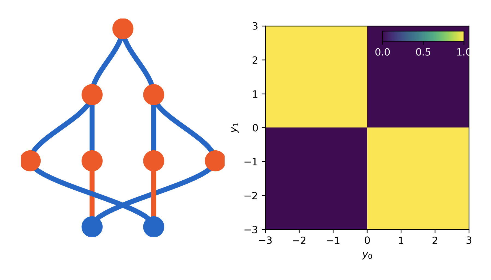

# Homework 1

## Problem 1*:

Implement a network that computes XOR (arbitrary number of hidden layers); meaning: the output should be +1 for y1 y2<0 and 0 otherwise!

# 🧠 Solution:

Notebook preview:
[HW1: Problem 1*](https://nbviewer.jupyter.org/github/mahdiaslanimk/ML-for-Physicists-Homeworks/blob/main/Homework%201/problem%201/HW1_Problem_1.ipynb)

