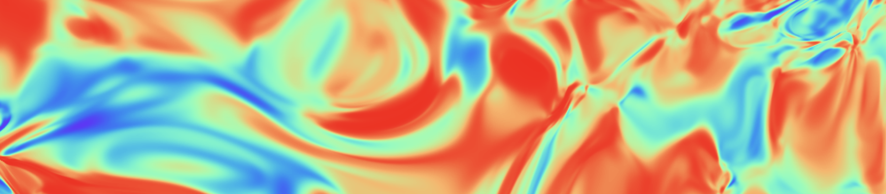

## Machine Learning for Physicists Homeworks

Homework solutions and results for the course [Machine Learning for Physicists](https://pad.gwdg.de/s/Machine_Learning_For_Physicists_2021#Most-important-info)

### Instructor:

[Prof. Dr. Florian Marquardt](https://mpl.mpg.de/divisions/marquardt-division/)

