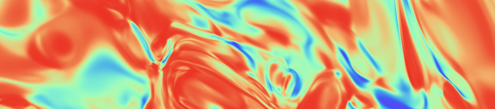

<h1 style="text-align: center;" >Machine Learning for Physicists Homeworks</h1>

  Homeworks for  the course 
<strong>
  <a src="https://pad.gwdg.de/s/Machine_Learning_For_Physicists_2021#Most-important-info">
    Machine Learning for Physicists
  </a>
</strong> 
by 
  <a src="https://scholar.google.com/citations?user=jx_c7SgAAAAJ&hl=en">
    Prof. Dr. Florian Marquardt
  </a>

